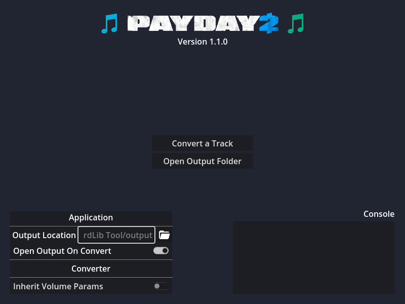

# Custom OST-to-BeardLib Tool
Custom OST-to-BeardLib Tool is a program that lets you port Custom OST tracks to BeardLib Music Module in just a few clicks, drastically easing the process. It supports most of Custom OST's features apart from `fade_duration`, `fade_in`, and `fade_out` (these have no equivalents in BeardLib as far as I know).

## Installing
- Download the latest version from Releases
- Extract to a folder
- Run

## Building
This application was built using Godot v4.2.2.

## Screenshots
